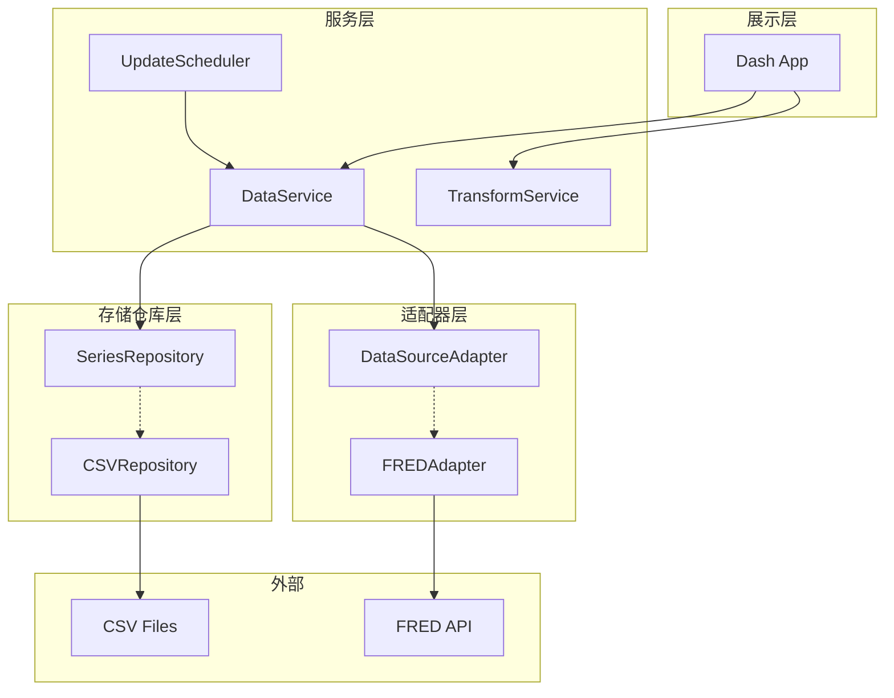
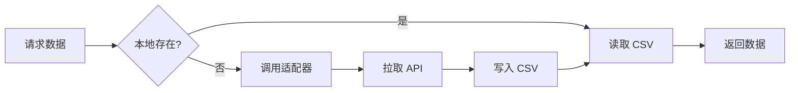

# Trasdy MVP 详细设计方案

基于 Dash + Plotly + CSV 的宏观经济数据分析平台。

## 待办事项

- [ ] 环境搭建：项目结构、requirements.txt、配置文件
- [ ] 存储仓库层：CSV 实现 + 抽象接口
- [ ] FRED 适配器：API 调用、数据转换
- [ ] 数据服务层：读取、增量更新、元数据管理
- [ ] 数据转换服务：Scale 归一化、时间窗口过滤
- [ ] Dash 应用：控制面板、Plotly 图表、回调逻辑

---

## 1. 整体架构



### 目录结构

```
trasdy/
├── app.py                        # Dash 应用入口
├── config/
│   ├── settings.py               # 全局配置
│   └── series_config.yaml        # 数据系列配置
├── data/
│   ├── raw/                      # CSV 文件
│   └── metadata.json             # 元数据
├── src/
│   ├── adapters/
│   │   ├── base.py               # DataSourceAdapter 抽象
│   │   └── fred_adapter.py
│   ├── repositories/
│   │   ├── base.py               # SeriesRepository 抽象
│   │   └── csv_repository.py
│   ├── services/
│   │   ├── data_service.py
│   │   ├── transform.py
│   │   └── scheduler.py
│   └── components/
│       ├── chart.py
│       └── controls.py
└── requirements.txt
```

---

## 2. 数据流逻辑



| 场景 | 流程 |
|------|------|
| 首次请求 | DataService → 检查 CSV 不存在 → FREDAdapter → API → 写入 CSV → 返回 |
| 本地有数据 | DataService → 读取 CSV → 返回 |
| 手动更新 | 用户点击按钮 → DataService.refresh_data() → 增量拉取 → 追加 CSV |

---

## 3. 核心接口设计

### 3.1 存储仓库抽象

```python
# src/repositories/base.py
class SeriesRepository(ABC):
    @abstractmethod
    def read(self, series_id: str, start_date=None, end_date=None) -> pd.DataFrame:
        pass
    
    @abstractmethod
    def write(self, series_id: str, data: pd.DataFrame, mode: str = "replace") -> int:
        """mode: 'replace' 覆盖, 'append' 追加"""
        pass
    
    @abstractmethod
    def exists(self, series_id: str) -> bool:
        pass
    
    @abstractmethod
    def get_date_range(self, series_id: str) -> tuple[date, date]:
        pass

class MetadataRepository(ABC):
    @abstractmethod
    def get(self, series_id: str) -> dict:
        pass
    
    @abstractmethod
    def update(self, series_id: str, updates: dict) -> None:
        pass
```

### 3.2 数据源适配器抽象

```python
# src/adapters/base.py
class DataSourceAdapter(ABC):
    @abstractmethod
    def fetch(self, series_id: str, start_date: str, end_date: str) -> pd.DataFrame:
        pass
    
    @abstractmethod
    def get_metadata(self, series_id: str) -> dict:
        pass
```

### 3.3 数据服务

```python
# src/services/data_service.py
class UpdateMode(Enum):
    FULL = "full"
    INCREMENTAL = "incremental"

@dataclass
class UpdateResult:
    series_id: str
    success: bool
    records_added: int
    error: Optional[str] = None

class DataService:
    def __init__(self, series_repo: SeriesRepository, metadata_repo: MetadataRepository):
        self.series_repo = series_repo
        self.metadata_repo = metadata_repo
    
    def get_series(self, series_ids: list[str], start_date: str, end_date: str) -> dict:
        """获取数据，优先读本地"""
        pass
    
    def refresh_data(self, series_ids: list[str] = None, 
                     mode: UpdateMode = UpdateMode.INCREMENTAL) -> list[UpdateResult]:
        """更新数据，支持增量/全量"""
        pass
    
    def get_available_series(self) -> list[dict]:
        """获取可用系列配置"""
        pass
```

### 3.4 调度器抽象

```python
# src/services/scheduler.py
class UpdateScheduler(ABC):
    @abstractmethod
    def start(self): pass
    
    @abstractmethod
    def stop(self): pass
    
    @abstractmethod
    def trigger_now(self, series_ids: list[str] = None): pass

class ManualScheduler(UpdateScheduler):
    """MVP: 手动触发，无定时"""
    pass

# 后期: APSchedulerAdapter 实现定时任务
```

---

## 4. 数据存储设计

### CSV 格式

```csv
date,value
2025-08-01,5432.12
2025-08-02,5445.67
```

### metadata.json

```json
{
  "SP500": {
    "source": "FRED",
    "description": "S&P 500 Index",
    "unit": "Index",
    "last_updated": "2025-08-01T10:30:00Z",
    "data_end_date": "2025-08-01",
    "auto_update": true
  }
}
```

### series_config.yaml

```yaml
series:
  - id: SP500
    name: "S&P 500"
    source: fred
    fred_series_id: SP500
    category: equity
    color: "#2E7D32"
  - id: DGS10
    name: "10年期国债利率"
    source: fred
    fred_series_id: DGS10
    category: treasury
    color: "#FFB74D"
  # ... 其他系列

categories:
  equity: "股指"
  rates: "政策利率"
  treasury: "国债利率"
```

---

## 5. FRED API

- **URL**: `https://api.stlouisfed.org/fred/series/observations`
- **认证**: API Key（免费申请）
- **限流**: 120 req/min
- **申请**: https://fred.stlouisfed.org/docs/api/api_key.html

### MVP 数据系列

| 系列 | FRED ID | 说明 |
|------|---------|------|
| S&P 500 | SP500 | 价格指数 |
| 联邦基金利率上限 | DFEDTARU | 目标区间上限 |
| 联邦基金利率下限 | DFEDTARL | 目标区间下限 |
| 1年期国债 | DGS1 | H.15 口径 |
| 3年期国债 | DGS3 | H.15 口径 |
| 10年期国债 | DGS10 | H.15 口径 |

---

## 6. 前端设计

### 布局

```
+------------------------------------------+
| [6个月|1年|3年|5年|全部] [○绝对值 ●Scale] |
+------------------------------------------+
| ☑ S&P 500    ☐ 联邦基金利率上限          |
| ☑ 10年期国债  ☐ 3年期国债                |
+------------------------------------------+
|          [Plotly 图表区域]               |
|       Hover / Zoom / Pan 交互            |
+------------------------------------------+
| [更新数据]          最后更新: 2025-08-01 |
+------------------------------------------+
```

### Scale 归一化

```python
def normalize_to_scale(series: pd.Series, base_date: str) -> pd.Series:
    base_value = series.loc[base_date]
    return (series / base_value) * 100
```

基准点：时间窗口第一个有效数据点 = 100

---

## 7. 扩展策略

### 架构扩展点

| 扩展方向 | MVP 预留 | 后续实现 |
|----------|----------|----------|
| 新数据源 | DataSourceAdapter 抽象 | YahooAdapter, CryptoAdapter |
| 存储切换 | SeriesRepository 抽象 | SQLiteRepository |
| 定时更新 | UpdateScheduler 抽象 | APSchedulerAdapter |
| 笔记系统 | 独立模块，无耦合 | SQLite 存储 + 图表标注 |

### 存储演进

```
MVP: CSV → Phase 2: SQLite → Phase 3: SQLite + 缓存
```

切换存储只需：
1. 实现新 Repository
2. 改 app.py 实例化
3. 数据迁移脚本
