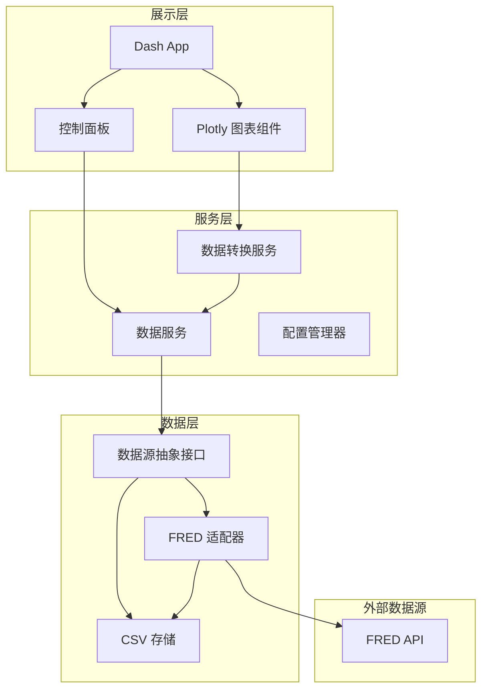

# Trasdy MVP 详细设计方案

## 概述

基于 Dash + Plotly + CSV 的宏观经济数据分析平台 MVP 详细设计，包含数据层、服务层、展示层的完整架构及向完整架构演进的扩展策略。

## 待办事项

- [ ] 环境搭建：项目结构、requirements.txt、配置文件模板
- [ ] FRED 适配器：API 调用封装、响应解析、CSV 存储逻辑
- [ ] 数据服务层：本地 CSV 读取、数据更新触发、元数据管理
- [ ] 数据转换服务：Scale 归一化算法、时间窗口过滤
- [ ] Dash 应用：控制面板组件、Plotly 图表组件、回调逻辑
- [ ] 集成测试：端到端数据流验证

---

## 1. 整体架构



### 1.1 目录结构

```
trasdy/
├── app.py                    # Dash 应用入口
├── config/
│   ├── settings.py           # 全局配置（API Key、路径等）
│   └── series_config.yaml    # 数据系列配置（可扩展）
├── data/
│   ├── raw/                  # 原始 CSV 文件
│   │   ├── SP500.csv
│   │   ├── DFEDTARU.csv
│   │   └── ...
│   └── metadata.json         # 数据元信息（最后更新时间等）
├── src/
│   ├── adapters/
│   │   ├── base.py           # 数据源抽象基类
│   │   └── fred_adapter.py   # FRED API 适配器
│   ├── services/
│   │   ├── data_service.py   # 数据读取/拉取服务
│   │   └── transform.py      # 数据转换（归一化等）
│   └── components/
│       ├── chart.py          # 图表组件
│       └── controls.py       # 控制面板组件
└── requirements.txt
```

### 1.2 核心模块职责

| 模块 | 职责 | 扩展点 |
|------|------|--------|
| `adapters/base.py` | 定义 `DataSourceAdapter` 抽象接口 | 新增数据源时继承此类 |
| `adapters/fred_adapter.py` | 封装 FRED API 调用，处理数据格式转换 | - |
| `services/data_service.py` | 统一数据访问入口，管理缓存策略 | 支持多数据源聚合 |
| `services/transform.py` | Scale 归一化、时间窗口过滤 | 新增指标计算 |
| `components/chart.py` | Plotly 图表封装，双 Y 轴支持 | - |

---

## 2. 数据存储设计

### 2.1 CSV 文件结构

每个数据系列一个 CSV 文件，统一格式：

```csv
date,value
2025-08-01,5432.12
2025-08-02,5445.67
...
```

- **date**: ISO 8601 格式 `YYYY-MM-DD`
- **value**: 浮点数，保留原始精度

文件命名：`{SERIES_ID}.csv`（如 `SP500.csv`, `DGS10.csv`）

### 2.2 元数据文件 `metadata.json`

```json
{
  "SP500": {
    "source": "FRED",
    "description": "S&P 500 Index",
    "unit": "Index",
    "last_updated": "2025-08-01T10:30:00Z",
    "start_date": "2025-02-01",
    "end_date": "2025-08-01"
  },
  "DGS10": {
    "source": "FRED",
    "description": "10-Year Treasury Constant Maturity Rate",
    "unit": "Percent",
    "last_updated": "2025-08-01T10:30:00Z",
    "start_date": "2025-02-01",
    "end_date": "2025-08-01"
  }
}
```

### 2.3 系列配置 `series_config.yaml`

```yaml
series:
  - id: SP500
    name: "S&P 500"
    source: fred
    fred_series_id: SP500
    category: equity
    color: "#2E7D32"
    
  - id: FED_RATE_UPPER
    name: "联邦基金利率上限"
    source: fred
    fred_series_id: DFEDTARU
    category: rates
    color: "#1976D2"
    
  - id: FED_RATE_LOWER
    name: "联邦基金利率下限"
    source: fred
    fred_series_id: DFEDTARL
    category: rates
    color: "#42A5F5"
    
  - id: DGS1
    name: "1年期国债利率"
    source: fred
    fred_series_id: DGS1
    category: treasury
    color: "#F57C00"
    
  - id: DGS3
    name: "3年期国债利率"
    source: fred
    fred_series_id: DGS3
    category: treasury
    color: "#FF9800"
    
  - id: DGS10
    name: "10年期国债利率"
    source: fred
    fred_series_id: DGS10
    category: treasury
    color: "#FFB74D"

categories:
  equity: "股指"
  rates: "政策利率"
  treasury: "国债利率"
```

---

## 3. 数据源与格式验证

### 3.1 FRED API 概述

- **Base URL**: `https://api.stlouisfed.org/fred/series/observations`
- **认证**: 需要 API Key（免费申请）
- **限流**: 120 requests/minute
- **申请地址**: https://fred.stlouisfed.org/docs/api/api_key.html

### 3.2 API 请求示例

```
GET https://api.stlouisfed.org/fred/series/observations
    ?series_id=SP500
    &api_key=YOUR_API_KEY
    &file_type=json
    &observation_start=2025-02-01
    &observation_end=2025-08-01
```

### 3.3 FRED API 响应格式

```json
{
  "realtime_start": "2025-08-01",
  "realtime_end": "2025-08-01",
  "observation_start": "2025-02-01",
  "observation_end": "2025-08-01",
  "units": "lin",
  "output_type": 1,
  "file_type": "json",
  "order_by": "observation_date",
  "sort_order": "asc",
  "count": 126,
  "offset": 0,
  "limit": 100000,
  "observations": [
    {
      "realtime_start": "2025-08-01",
      "realtime_end": "2025-08-01",
      "date": "2025-02-03",
      "value": "6040.53"
    },
    {
      "realtime_start": "2025-08-01",
      "realtime_end": "2025-08-01",
      "date": "2025-02-04",
      "value": "6037.88"
    }
  ]
}
```

### 3.4 数据格式转换逻辑

```
FRED Response → DataFrame → CSV
```

转换要点：

- `value` 为字符串，需转 float
- 缺失值表示为 `"."`，需处理为 NaN 或跳过
- 非交易日无数据（正常现象）

### 3.5 MVP 数据系列清单

| 系列 | FRED ID | 频率 | 说明 |
|------|---------|------|------|
| S&P 500 | SP500 | 日 | 价格指数（不含分红） |
| 联邦基金利率上限 | DFEDTARU | 日 | 目标区间上限 |
| 联邦基金利率下限 | DFEDTARL | 日 | 目标区间下限 |
| 1年期国债 | DGS1 | 日 | H.15 口径 |
| 3年期国债 | DGS3 | 日 | H.15 口径 |
| 10年期国债 | DGS10 | 日 | H.15 口径 |

---

## 4. 前端交互设计

### 4.1 布局结构

```
+--------------------------------------------------+
|                    控制面板                        |
|  [时间范围: 6个月 | 1年 | 3年 | 5年 | 全部]         |
|  [显示模式: ○ 绝对值  ● Scale(归一化)]              |
+--------------------------------------------------+
|                                                   |
|  ☑ S&P 500                                       |
|  ☐ 联邦基金利率上限                                |
|  ☐ 联邦基金利率下限                                |
|  ☑ 10年期国债利率                                  |
|  ☐ 3年期国债利率                                   |
|  ☐ 1年期国债利率                                   |
|                                                   |
+--------------------------------------------------+
|                                                   |
|              [Plotly 图表区域]                     |
|         支持 Hover、Zoom、Pan 交互                 |
|                                                   |
+--------------------------------------------------+
|  [手动更新数据] 按钮  |  最后更新: 2025-08-01      |
+--------------------------------------------------+
```

### 4.2 Scale 归一化算法

```python
def normalize_to_scale(series: pd.Series, base_date: str) -> pd.Series:
    """
    将价格序列归一化为以 base_date 为 100 的 scale 值
    
    公式: scale_value = (current_value / base_value) * 100
    """
    base_value = series.loc[base_date]
    return (series / base_value) * 100
```

基准点选择：所选时间窗口的第一个有效数据点

### 4.3 图表配置

- 双 Y 轴支持（未来扩展用，MVP 可简化为单轴）
- 支持图例点击隐藏/显示
- Hover 显示：日期 + 原始值 + Scale 值
- 时间范围预设：6个月、1年、3年、5年、全部

---

## 5. 核心接口设计

### 5.1 数据源抽象接口

```python
# src/adapters/base.py
from abc import ABC, abstractmethod
from typing import Optional
import pandas as pd

class DataSourceAdapter(ABC):
    """数据源适配器抽象基类"""
    
    @abstractmethod
    def fetch(
        self, 
        series_id: str, 
        start_date: str, 
        end_date: str
    ) -> pd.DataFrame:
        """从远程数据源拉取数据"""
        pass
    
    @abstractmethod
    def get_metadata(self, series_id: str) -> dict:
        """获取数据系列的元信息"""
        pass
```

### 5.2 数据服务接口

```python
# src/services/data_service.py
class DataService:
    """统一数据访问服务"""
    
    def get_series(
        self, 
        series_ids: list[str], 
        start_date: str, 
        end_date: str
    ) -> pd.DataFrame:
        """获取多个数据系列，优先读取本地缓存"""
        pass
    
    def refresh_data(
        self, 
        series_ids: list[str] = None
    ) -> dict:
        """手动触发数据更新，返回更新结果"""
        pass
    
    def get_available_series(self) -> list[dict]:
        """获取所有可用的数据系列配置"""
        pass
```

---

## 6. 向完整架构演进策略

### 6.1 架构扩展路线图


### 6.2 扩展点设计

| 扩展方向 | MVP 预留设计 | 后续实现 |
|----------|--------------|----------|
| **新数据源** | `DataSourceAdapter` 抽象接口 | 新增 `YahooAdapter`, `CryptoAdapter` 等 |
| **贵金属** | `series_config.yaml` 支持多 source | 对接黄金/白银 API |
| **笔记系统** | 图表组件预留 annotation 接口 | 新增 SQLite 存储笔记 |
| **新闻模块** | 独立于数据模块，无耦合 | 新增新闻服务 + 时间线关联 |
| **自动更新** | 数据服务预留 scheduler 接口 | 接入 APScheduler |

### 6.3 配置驱动设计

通过 `series_config.yaml` 实现配置化：

- 新增数据源只需添加新的 source 类型和 adapter
- 新增数据系列只需在配置中添加条目
- 前端自动根据配置渲染可选系列

### 6.4 存储演进路径

```
Phase 1 (MVP): CSV 文件
    ↓
Phase 2: CSV + metadata.json（支持更多元信息）
    ↓
Phase 3: 迁移至 SQLite（笔记系统需要）
    ↓
Phase 4: SQLite + 缓存层（性能优化）
```

CSV 到 SQLite 迁移成本低，数据格式统一为 `(date, value)` 表结构可直接映射。
